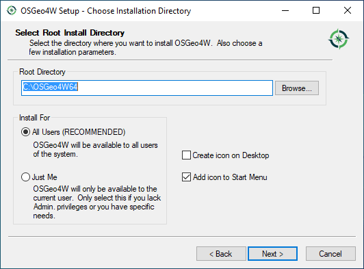
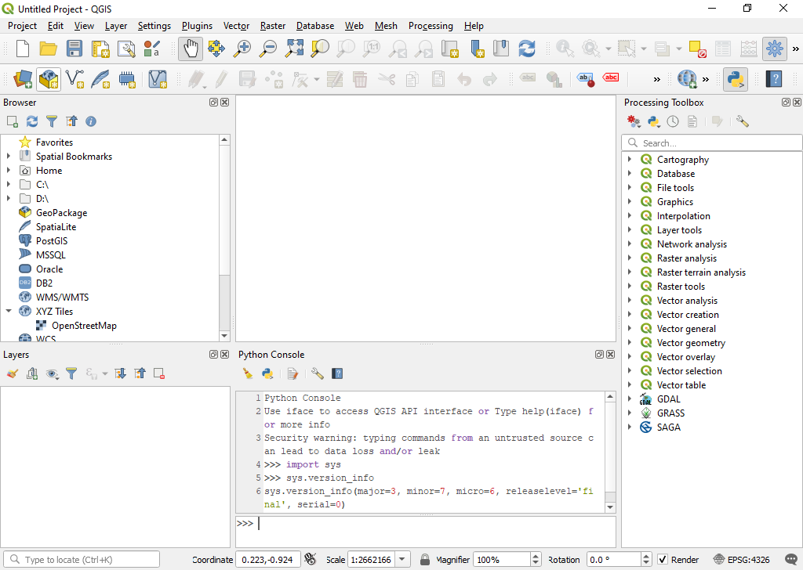

Open source GIS for the win; except we haven't taught it in any classes yet.
Here we go.
Let's start with a bit about QGIS and how you get a copy of it.

QGIS is the leading open-source desktop GIS software, is available [here](https://www.qgis.org).
This means that no matter which major operating system you are running (Windows, macOS, or a flavor of Linux), you should be able to get QGIS up and running.

One of the strengths of QGIS is that---in addition to providing a GIS interface of its own---it also integrates tools from a range of other GIS programs. These include:

-   The Geospatial Data Abstraction Library ([GDAL](http://www.gdal.org/)), which provides a suite of tools and programs for converting and manipulating spatial data
-   The Geographic Resources Analysis Support System ([GRASS GIS](http://grass.osgeo.org/)), which is a complete GIS system in its own right, but has until recently been largely a command-line application.

## Installation
Clicking on the **Download Now** option will take you to "Download QGIS for your platform" page.

### On a Mac
<iframe width="560" height="315" src="https://www.youtube.com/embed/908NyL7roFs" frameborder="0" allow="accelerometer; autoplay; encrypted-media; gyroscope; picture-in-picture" allowfullscreen></iframe>

### On Windows
I prefer to use the OSGeo4W Network Installer (64-bit), but you are welcome to use the standalone installer.

The reason I like the OSGeo4W Network Installer is that I get the Advanced Install options screen.

When you run the installer, you will get a screen like this:

I personally like to know what I'm getting, so I do the Advanced Install, which takes you to a series of menus where you click "Next" to

* Choose Installation Type: Install from Internet
* Choose Installation Directory: Install for All Users (Recommended)
* Select Local Package Directory: defaults directories are fine
* Select Connection Type: Direct Connection
* Choose Download Sites: I use the second one, http://download.osgeo.org (I think the first one is in France)

|                                    |                                        |
|:-----------------------------------|---------------------------------------:|
|  |  |
|  |  |

After muddling through those option screens you are presented with the "Select Packages" screen.

Here's where things get interesting.
You have options to select the packages you want from the following drop-down menus:

* Commandline_Utilities
* Desktop
* Libs
* Web

Once you've selected your personal options, the next screen will check to make certain all dependencies are met and ask that you also include them with your download/installation.
We can always come back to this screen to add/change/remove options later, so let's start with just getting the goods, which I personally choose to be qgis-ltr-full under Desktop or just type it in the search at the top.
Click Skip to change it to Install.
In the image below, you'll see that I've already installed a version.

Clicking Next will take you to the Resolve Dependencies screen.
Click Next to install these packages to meet dependencies.

If you have time to browse, you'll find some nice Easter eggs available in OSGeo4W, including:

* Libs/ffmpeg (audo/video encoding)
* Libs/java (the Java runtime environment)
* Libs/opencv (computer vision library)
* Libs/python3-pandas (data analysis and statistics package)

## Interface
When you open QGIS Desktop, click on the **New Project** button in the toolbar.
Just like ArcGIS, QGIS also stores your work (e.g., links to data layers, symbology, label preferences) in a project file.

* The QGIS project file (.qgs)
* The ArcMap project file (.mxd)
* The ArcGIS Pro project file (.aprx)

No matter the flavor of GIS software, no spatial data is stored in your project file.

:   Table: Side by side comparison of QGIS Desktop (left) and ArcGIS Pro (right).

|                                    |                                        |
|:-----------------------------------|---------------------------------------:|
|  |  |

The graphical user interface (GUI) of QGIS has analogs to ArcGIS:

* **Browser** = **Catalog Pane**
* **Layers** = **Contents Pane**
* **Processing Toolbox** = **Geoprocessing Pane**

Some things are rearranged a bit, including the status bar, which is below the map pane in ArcGIS Pro and along the bottom of the window in QGIS.
ArcGIS Pro utilizes the Microsoft Office-esque ribbon with groups and tools while QGIS uses the more standard menus and toolbars.

Notably, QGIS projects do not start you out with a basemap, while ArcGIS Pro gives you two representational state transfer (REST) services for a basemap and hillshade.

To get a basemap in QGIS, you can either double-click on OpenStreetMap under XYZ Tiles in the Browser or install the [QuickMapServices plugin](https://digital-geography.com/qgis-quickmapservices/), which offers some options for basemap layers or dozens when you get the contributed pack from the plugin settings.

## Notable Differences
Working in QGIS after spending time with ArcGIS, you will come across some notable differences, such as:

Add Data

* ArcGIS does not really care about the data model of the spatial data you want to add to a map.
    In QGIS, the Data Source Manager requires you select the data model (e.g., Vector, Raster, Delimited Text) and choose the correct file.
    This can be tricky, especially for shapefiles, where there are several files associated with a single shapefile.
    Luckily, in the bottom corner of the selection window, there is a file filter that lets you choose what type of data you are expecting to find.
    By default, the filter is set to  **All files (\*)**.

Projections

* **Project** and **Project Raster** are big deals in the world of ArcGIS; however, data projections, by default, are handled on the fly in QGIS to match the projection of your project ([read more](https://docs.qgis.org/3.10/en/docs/user_manual/working_with_projections/working_with_projections.html)).
    If you want your data stored in a new/different projection, you have to right-click the layer to Export as a new raster or vector file.
    During the export, you can specify what the new CRS should be.
