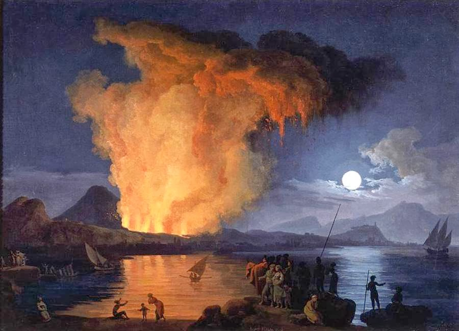

## Blue Team

### "It's the End of the World as We Know It"

{width=640 height=461}

Intended goals
:   - Understand the role of GIS in disaster response
    - Exercise data exploration and feature geolocating and projecting
    - Utilize geoprocessing tools for suitability analysis
    - Analyze maps to determine specific outcomes

**Problem Statement**

Hawaii is well known for its vulnerability to natural disasters, such as volcanic eruptions and tsunamis.
Recent seismic measurements have indicated that a volcanic eruption is imminent.
A gigantic wave further threatens the people living along the coastal regions of the state.

You less than one hour to provide recommendations for suitable locations where people can seek safety from both the volcano and a tsunami.

You may use whatever information is available to you.
This includes GIS data from previous classes and from other web sources.
You may use ArcGIS Pro, QGIS, Google Earth, or other web-based mapping service.

**Before You Begin**

1. Meet with your team and introduce yourselves.
1. Consider the information you need.
    a. Quickly brainstorm a list of information you think you need to solve this problem.
    a. Examine your list and prioritize each item as either critical or supplemental to addressing this issue.
    a. Starting with your critical items, make a note next to each item of who or where you might be able to get this information from.
1. Identify sources.
    a. Find Mauna Loa volcano's location.
        - address:
        - coordinates in longitude and latitude:
        - elevation above mean sea level:
        - other location identifiers:
    a. What resources did you use to find these answers?
1. Define the space.
    a. Find maps of the volcano hazard regions of Hawai'i Island and of the tsunami evacuation zones (*Hint: try using the Hawaii Open Data Portal*).
    a. Do your best to draw or create a map that combines both Mauna Loa volcano risk zones and tsunami evacuation zones.
        - Which appears to be the greater risk with respect to impacted area?
        - Is there any overlap between the two risk zones? If so, where?
    a. Estimate the size of your impact areas.
        Be sure to include units with your answer (for example: acres, hectares, square miles).
        How did you determine the area?
1. Analyze your impact area
    a. Use an online mapping service---e.g., Apple Maps (&copy; Apple, Inc.), Bing Maps (&copy; Microsoft Corp.), Google Earth (&copy; Google LLC)---to examine what is inside your impact areas.
    a. Who or what do you think is at most risk from a volcanic eruption and/or tsunami?
        Can you find any instances of them inside your impact area?
    a. Estimate the number of each of the following found inside your impact area.
        - schools:
        - hospitals:
        - protected areas:
    a. How might you go about determining the number of people impacted by these disasters?
    a. How can you best get people to one of the safe locations?
        Consider a Hawaiian resident and someone from a foreign country.
        How would you give directions to this location to both of these people?
        You may have different answers depending on the person.

Delegate tasks among your team.
You don't have a lot of time to come up with your solution.
Decide who will be in charge of what tasks.
Take advantage of each other's strengths.
Pair up when possible.

**Questions to Answer**

1. What is the approximate area impacted by these disasters?
1. About how many people are in danger?
1. Conduct a quick suitability analysis.
    - What is the total area (mi2) of your highest suitable region?
1. Based on the number of people potentially impacted, do you think it feasible for everyone to fit within the safety area(s) you identified?
1. Are there any existing structures within the safety area(s) that could be retrofitted as shelters?
1. Based on the location of populated areas in Hawaii (for example, major cities or towns), what are the recommended routes for getting people in these areas to safety?
1. If people are not able to reach the safety region you identified, do you have recommendations for alternative "next-best" safe locations?

Include figures in your report.

- island map with suitable safety locations and/or impacted areas identified
- map showing populated areas, road networks, and suitable locations for evacuees; should include a direction arrow and scale bar
