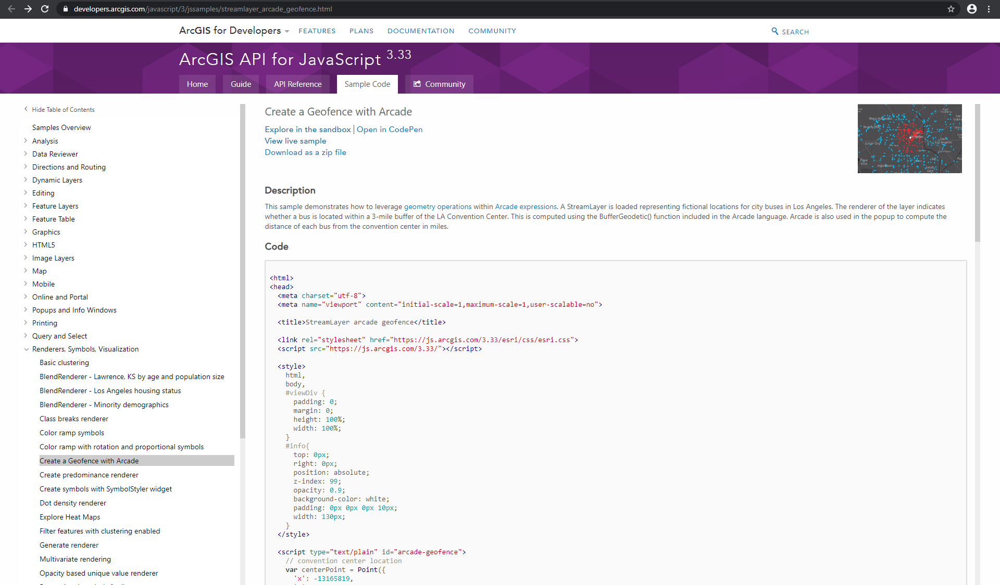

# Conceptual Design

*a description of how a product works and meets its requirements*

*the big idea*

*innovation*

# The Conceptual Model

Idea &rarr; Requirements &rarr; Concept

***

Idea
:   Create a geofencing web app.

***

Requirements
:   Must tell a story around a user's location.

***

<section data-background-image="img/concept_diagram.png" data-background-size="fill">
<aside class="notes">
</aside>
</section>

***

<section data-background-image="img/sequence_diagram.png" data-background-size="fill">
<aside class="notes">
</aside>
</section>

# Example Application

