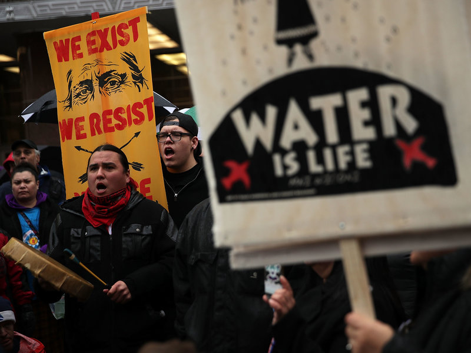

# What are Geoethics?

***

> "not a limit to the freedom of action but a new opportunity [...] to contribute [...] the best way forward for society"

<small>Peppoloni & Di Capua (2016)</small>

***

{width=400 height=300}

# Environmental Ethics

> the tradeoff between ethical concerns and short-term economic benefits

<small>\* these both relate to what we _value_ and how our values influence our actions</small>

# Values

How do we value things?

***

| VALUE | DESCRIPTION |
|--|--------|
| Use value | Something we use directly  |
| Existence value | Knowing that something exists, even if we never experience it ourselves |
| Option value | Something we might use later |
| Aesthetic value | Something of beauty or emotional appeal |
| Scientific value  | Something for research |
| Educational value | Something for teaching and learning |
| Cultural value | Something that sustains or defines a culture |

***

|  |  |
|--|--|
| __MORALS__ | __ETHICS__ |
| Personal principles with respect to right/wrong | Rules of conduct with respect to our culture |
| Individual | Societal |
| Internal | External |
| Something we "believe in" | Because society "says so" |
| Transcendental | Governed |

# Ethics

> the set of morals or beliefs of a given group that guide and clarify our actions

... so who is the group?

***

Relativists
:   each culture _should_ be allowed their own ethics

(e.g., freedom of religion)

***

Universalists
:   there exist a single set of ethics that hold true for all cultures

(e.g. human rights/equality)

# From here things get tricky

# Back to geoethics

# Resources

- [Definition of Geoethics (IAPG)](http://www.geoethics.org/definition)
- [The Emerging Field of Geoethics, Bobrowsky et al. (2017)](http://www.geoethics.org/articles-geoethics#comp-jjfx3jvm)
- [International Association for Promoting Geoethics](http://www.geoethics.org/)
