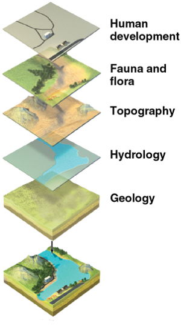

## It All Starts With a Map

> Maps are both the raw material and the product of geographic information systems (GIS)."
>
> --- Xi Liu, Penn State University

### What are maps?

{#fig:layers .float-rt-img height=400 width=223}

A map is a symbolic representation that approximates any real-world location or object in three dimensions onto a two-dimensional surface (for example: on paper or on a computer monitor).
These symbolic representations may consist of several visual variables including: *shape*, *orientation*, *color*, *texture*, *value*, and *size*.

More generally speaking, maps are information and, as we know, information is powerful.
When it comes to information, good information can help improve our lives by empowering us to make better decisions.
Information comes from our understanding of data---in this case, the symbolic representations of the spatial arrangement of our world, which are called *features*.

GIS typically convey maps in separate *thematic layers*, or features of common geographic information, which may represent roads, houses, vegetation cover, population density, etc.
Because the layers are geographically referenced, they may overlay one another to build a more complete picture of the geographic area (see figure pictured right.)

* [Dr. Roger Tomlinson](https://en.wikipedia.org/wiki/Roger_Tomlinson)---considered the "father of GIS"---describes the concepts of thematic layers and overlays as the cornerstone of GIS.
* Maps also serve as a form of communication that can illustrate similarities and differences between places.
* Maps help us conceptualize by enabling us to reconstruct our past, illustrate the present, and plan for the future.

Understanding maps allows us to answer important questions, like the "where" (i.e., *absolute* and *relative locations*) and "what" (i.e., properties and attributes) of important features.

#### Lexicon

Below are some terms and definitions to help with conceptualizing our ideas of maps, features, and locations.

map
:   a way of representing any real-world location or object on a two-dimensional surface (for example: on paper or a computer monitor)

feature
:   a symbolic representation of the real world (e.g., points, lines and polygons)

absolute location
:   a way of describing a position based on a fixed point on Earth (e.g., longitude and latitude)

relative location
:   a position defined with respect to other locations

### What is GIS?

> Geographic information systems (GIS) are computer-based systems to aid in the collection, maintenance, storage, analysis, output, and distribution of spatial data and information."
>
> --- @bolstad12

Because of the importance of spatial information, we have developed tools called geographic information systems (GIS).
We use GIS to gather and use spatial data.

The breadth of GIS encompasses the latest technology of advanced communication networks and software down to the simplest hand-drawn field maps.
Modern technology is changing the way we use GIS and how we gather and use spatial data continues to evolve.

Note that many GIS software packages exist---some quite specialized, others quite broad---and the techniques that we explore form a common core of GIS that can be applied across various platforms.

### Why use GIS?

GIS lends us the utilization of maps, which provides us with the tools to answer questions regarding the "what" and the "where" of things.
These are important questions for planning and resource management.
There is another use for GIS, which is to answer analytical questions, such as "why" or "what if" through GIS models and prediction.

While GIS was originally an extension of managing and analyzing traditional paper maps, it has since become primarily computer-based and there are several reasons for this, including the following:

- computers are better at handling complex spatial analyses that would otherwise be impossible or impractical on paper
- computers provide large storage capacity for managing a massive amount of map data
- computers allow for the integration of other digital multimedia content (photos, videos, websites, etc.) into map documents
- computers allow multiple mapping layers to be viewed in the same projection and map scale (pending appropriate conversions)
- computers and computer networks allow for maps to be easily copied and shared with other users
- computers eliminate *some* of the biases associated with paper maps
- computer-based maps are easier to update, fix or amend than paper copies
- computer-based maps are easier to customize for individual uses
- computers foster the development of new tools and processes to further our understanding of spatial data

## Software

### ArcGIS

{#fig:arcfam .float-rt-img height=200 width=200}

ArcGIS is developed by Environmental Systems Research Institute, Inc. (referred to as Esri).

ArcGIS Desktop allows you to create, edit and analyze geographic data on your desktop.
This includes the ability to:

- see your data on a map
- analyze your data to reveal patterns, relationships and trends that are not apparent in tabular format
- create publication-quality maps

ArcGIS Desktop applications include:

- *ArcCatalog*: browse geographic data sources and create/update metadata
- *ArcMap*: display and query geographic data on maps and edit/export data
- *ArcToolbox*: access to powerful tools for performing geoprocesses, spatial analysis and data conversions

### ArcMap

Main Concepts:
:   - Map document
    - Data frame
    - Layer
    - Map scale
    - Pathname
    - Source
    - Thematic mapping

ArcMap uses map documents (.mxd files) to collect spatial data for visualization and analysis.
Map documents do not contain any GIS data; rather, they store the names and locations of sources (i.e., spatial data).
Therefore spatial data can be shared across multiple map documents, but **any change to a data source will affect all map documents that reference it.**

The names and locations of sources are stored as pathnames (i.e., the source's address on your computer).
Pathnames may be stored either as absolute pathnames (i.e., the source address beginning with your computer's driver letter) or relative pathnames (i.e., the source address relative to the folder containing the current map document).
Absolute pathnames are a good way of referencing data sets that are always in the same location for every user.
Relative pathnames are better for referencing data sets that are moved about (e.g., located on a USB drive).

Layers with pathnames that cannot be found (e.g., because the source address has changed), will show with a red exclamation point beside their name in ArcMap's Table of Contents.

Spatial data (e.g., feature class or raster) are added to a map document as layers.
A layer serves as a reference that points to spatial data and includes information for ArcMap on how to display and use these data.

Layers are organized under data frames.
A data frame is a group of layers that are all drawn together.

It is a strength of ArcMap to produce maps, not just of a layer's spatial features, but also to highlight the non-spatial information associated with these features (e.g., attributes).
This technique is called thematic mapping.

Spatial data is visualized in ArcMap at varying map scales, which can be interactively changed by zooming into or out of the map.
The map scale is a measure of the size of features presented in the visualization to their actual size, typically represented as a fraction or ratio.
For example, a typical topographic map by the United States Geological Survey has the scale 1:24,000.
This means that every 1 inch on the map represents 24,000 inches on the ground.

### ArcGIS Pro

The next evolution of ESRI's ArcGIS Desktop software slated to replace ArcMap.
ArcPro uses projects (.aprx files) as the basis for bringing together data layers and visualizations.
It includes all the benefits described above for ArcMap wrapped in a new user interface with backends written in the Python 3 computer programming language.

For help, see [Getting Started with ArcGIS Pro](https://www.esri.com/training/catalog/57630435851d31e02a43f007/getting-started-with-arcgis-pro/).

### QGIS

QGIS is an open-source GIS program, which has evolved in recent years to be a
strong competitor to ArcGIS as a personal GIS platform.
QGIS has a decent user interface and it is also possible to script and automate analyses.

One of the strengths of QGIS is that---in addition to providing a GIS interface of its own---it also integrates tools from a range of other GIS programs.
These include:

- The Geospatial Data Abstraction Library ([GDAL](http://www.gdal.org/)), which provides a suite of tools and programs for converting and manipulating spatial data
- The Geographic Resources Analysis Support System ([GRASS GIS](http://grass.osgeo.org/)), which is a complete GIS system in its own right, but has until recently been largely a command-line application.

### Python

Computer programming languages come in a variety of languages and it may be difficult to choose one language to learn.
For GIS, and increasingly in the computational sciences, Python is a good choice for the following reasons:

1. First, it's considered a high-level language, which means it's easier---and as a result, generally faster---for us to read and write.
    This tends to make development quicker and simpler.
2. Second, it's an object-oriented language, which has several advantages over structured or functional programming, by simplifying the process of creating programs through the use of specially defined classes of objects.
    These objects encapsulate a specific set of rules, parameters and functions that can easily be maintained, reused, shared and/or scaled.
3. Lastly, in addition to the standard Python library, there is a plethora of well-documented and supported third-party packages to help support a variety of projects.
    Namely, the industry standard GIS software company, ArcGIS, and the world's leading open-source desktop GIS software, QGIS, both provide Python support.

In addition to Python packages that link to GIS processes (e.g., [arcpy][arcpy], [ArcGIS API for Python][arc-api], and [pyqgis][pyqgis]), programmers are taking advantage of interactive development tools, such as Jupyter Notebooks.
[ArcGIS Notebooks][arc-notebook] provide the tools for accessing datasets, scripting processes, visualizing data, and documenting methods.

[arc-api]: https://developers.arcgis.com/python/
[arc-notebook]: https://www.esri.com/en-us/arcgis/products/arcgis-notebooks/overview
[arcpy]: https://pro.arcgis.com/en/pro-app/latest/arcpy/get-started/what-is-arcpy-.htm
[pyqgis]: https://qgis.org/pyqgis/master/

## References
