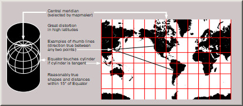
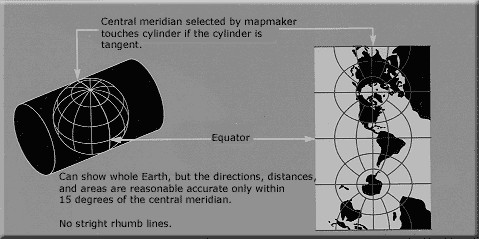
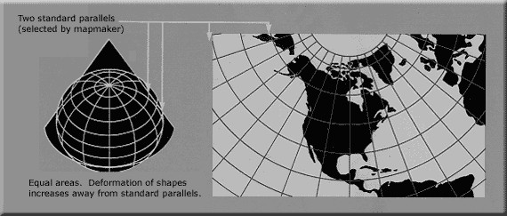
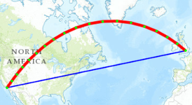

> To any point on the earth's surface may be attached a locational reference of some form, be it a pair of Cartesian coordinates at large scales or latitude and longitude at smaller scales.&#8221;
>
> --- @maling91

## The Shape of the Earth

The origin of geographic coordinates begins with how we define the size and shape of Earth.
Earth was originally thought to be in the shape of a sphere.
This was first reasoned by Pythagoras (570--495 B.C.) and later by Aristotle (384--322 B.C.).
It was not until Sir Isaac Newton (1643--1727 C.E.) that Earth's shape was reasoned to be an *ellipsoid*.

ellipsoid
:   three dimensional shape generated by rotating an ellipse about its shorter axis

geoid
:   irregular three-dimensional shape representing Earth at approximately mean sea level based on Earth's gravity fields

Earth's circumference was first calculated within 4% of modern estimates by Eratosthenes (276--194 B.C.).

## Geographic Coordinate Systems (GCS)

In order to display and analyze maps on screen, a GIS system uses coordinate pairs that specify the location and shape of a particular feature.
The geographic coordinate system (GCS) aids defining where coordinate pairs are located in space, whereby *x*-*y* coordinate pairs are defined in degrees of longitude and latitude.

GIS tools layer geospatial data for a given area; therefore it is important that the coordinate systems of these layers be the same.

datum
:   a reference from which spatial measurements are made; a set of points (coordinate locations) specifying positions on Earth's surface

latitude
:   angular measurement north or south of the equator; also known as parallels

longitude
:   angular distance measured east or west from a given meridian (e.g., the Prime Meridian located at the Royal Observatory in Greenwich, England); also known as meridians

origin
:   defined by coordinates (0,0)

point
:   described by a single *x*-*y* coordinate pair

line
:   a series of *x*-*y* coordinates

In reality, layers are often not in the same coordinate system or resolution; therefore, they must undergo projection or transformation.

## Projected Coordinate Systems

Because the earth is not flat, any map is a projection of the surface of the Earth onto a flat surface, whether it is a printed map or GIS data on a screen.

To complicate things, a map projection is actually defined by two components:

1. The *geographic coordinate system*, which describes the position of the points on the surface of the Earth as latitude and longitude.
The geographic coordinates will vary depending on the model used to describe
the surface of the earth.
The model (or datum) consists of a spheroid---the shape of the earth in
terms of radius and flattening---and this can be local or global.
2. The *projected coordinate system*, which are the XY positions of latitude and
longitude points on the flattened surface.

To maximize information from a given map, it is ideal that it preserves the shape, area, distance and direction; however, these properties cannot all be preserved at once.

Mercator Projection
:   cylindrical projection that preserves angles and shapes of small objects, but distorts the size and shape of large objects

    {width=500px height=auto}

Transverse Mercator Projection
:   the Mercator projection rotated 90 degrees

    {width=500px height=auto}

USA Contiguous Albers Equal Area Conic USGS version
:   used by the USGS, this coordinate system is good for mapping the continental United States with minimal distortion. It is best for land masses that extend from east to west more than north to south, making it perfectly suitable for the U.S.

    {width=500px height=auto}

Universal Transverse Mercator (UTM) Coordinate System
:   a standard set of map projections developed by the U.S. Military and widely adopted for coordinate specification over regional study areas. There are 60 six-degree wide UTM zones.

    {#id .class height=250px width=500px}

### Projection Types

There are hundreds of different projections, some of which are defined below.

- Conformal: maintains local angles and shapes
- Equal-area: maintains area
- Equal-distant: maintains distance
- True-direction: maintains directions with respect to a fixed central point
- Universal Transverse Mercator (UTM): maintains both conformal and equal area

### Projection Distortions

The Mercator projection attempts to flatten the spherical surface of Earth, which results in the exaggeration of object sizes as the distance from the equator increases.

{#id .class height=500 width=500}

Due to these limitations, for large-scale maps, equal-area projections are recommended in place of the Mercator projection.

*Geodesic* geometry attempts to account for distance distortions caused by coordinate system projections.
A geodesic line represents the shortest distance between two points across the Earth's surface.
For example, if you wanted to determine the shortest distance between two cities for an airplane's flight path.

What this all boils down to is that if you want to work with GIS datasets, then you need to remember that datasets come with a projection.
You must keep track of these projections or your data are not going to be where you think they are.

## References
