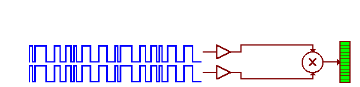

> There's power in knowing where potentially anything in the world is."
>
> ---Greg Milner, journalist and author

## What is GPS?
GPS (Global Positioning System) is essentially a highly reliable signal sent from space that carries two critical pieces of information: location and time.

## What is GPS used for?
The sky is really the limit on what you can do with GPS.

Some examples of GPS application include:

- fleet management (i.e., GPS tracking)
- navigation
- precision agriculture
- science
    - Continuously Operating Reference Stations, [CORS](https://www.ngs.noaa.gov/CORS/)
        - consists of "monuments" that are located all over the world
        - performs differential GPS (DGPS)
        - provides Global Navigation Satellite System (GNSS) data consisting of carrier phase and code range measurements in support of three dimensional positioning, meteorology, space weather, and geophysical applications throughout the United States, its territories, and a few foreign countries
- timing (e.g., credit card transactions, stock market trades)

## How does GPS work?
The basic methodology of GPS:

- A GPS signal originates from an orbiting satellite above Earth and travels at approximately the speed of light to the surface, which takes about 70 milliseconds (0.07 seconds)
- A GPS receiver (user) at the surface observes the GPS signal, which now carries a phase change
- By using the phase change, the delay time between when the signal was sent by the satellite and when it was received by the user can be estimated
- Knowing this delay time (or time of arrival), the *range* (the distance from the user to the satellite) can be calculated (i.e., distance $=$ velocity $\times$ time)
- Finally, by knowing the distance between the user and several (at least four) GPS satellites (known as a *lock* or a *fix*), the location of the user can be determined

There are four key elements to making GPS work:

1. Known transmission time
    - based on high-precision clocks and Einstein's theory of general (time travels faster under lower gravity) and special relativity
2. Known satellite location
    - based on globally distributed reference networks and Newtonian physics
3. Speed of radio wave
    - very close to the speed of light (1 foot per nanosecond)
4. Time of arrival
    - based on correlation of spread spectrum signals

With these four key elements we can begin to solve the "pseudo-range" equation.
It is called pseudo-range because it is not the true range, but is equal to the true range plus some bias (due to the differences in time between the satellite and user).

This distance defines a sphere around a satellite.
When combined with three more satellite distances, these distances can pin-point a location.

Because GPS measures distance, it uses the method of **trilateration**, rather than **triangulation**, which is used by surveyors for measuring angles.

 (2016). https://gisgeography.com/wp-content/uploads/2016/11/GPS-Trilateration-Feature-678x322.png](https://gisgeography.com/wp-content/uploads/2016/11/GPS-Trilateration-Feature-678x322.png)

Note than the receiver clock is not synchronized to the GPS time.
The result of these asynchronous clocks is a bias.

The fact that GPS uses a pseudo-range rather than the true range allows for the user's GPS receiver to function with a low-cost, low-precision clock.
If this were not the case, the proliferation of GPS as we know it today would have never happened due to the incredible expense of high-precision clocks.

Because GPS receivers must solve for their time bias (at the extra expense of needing a fourth satellite), there is the added bonus that every GPS receiver has a measure of its exact time.

#### True range equation
At the very basic level, we are trying to estimate the true range (or distance) between the satellite and the receiver.
This distance can be calculated (assuming a perfect vacuum between the satellite and receiver) as the following:

$c \times \left( t_\mathrm{arrival} - t_\mathrm{transmit} \right) = d$

where

- $t_\mathrm{arrival}$ is the time of arrival (clock time on the receiver when the message was received)
- $t_\mathrm{transmit}$ is the time of transmission (clock time on the satellite when the message originated)
- $d$ is the distance between the receiver and the satellite
- $c$ is the speed of light

Due to asynchronous receiver/satellite time, the bias affects the arrival time; therefore, the range equation becomes more like the following:

$c \times \left( t_\mathrm{arrival} + t_\mathrm{bias} - t_\mathrm{transmit} \right) = d$

where

- $t_\mathrm{bias}$ is the clock bias due to asynchronous receiver/satellite time

#### Pseudo-range equation
Due to the clock bias, there are four unknown variables to be solved for in the pseudo-range equation.
These include the clock offset of the user's receiver (i.e., the bias) and the $x$, $y$ and $z$ coordinates of the user's location (i.e., the latitude, longitude and altitude).
Because there are four unknowns, the user must have links with at least four different GPS satellites (known as a "lock" or "fix").

$\tau_{c}(t) = \left( \frac{d_{u}^{(k)}}{c} + b_u - \delta B^{(k)} \right) + \delta I_u^{(k)} + \delta T_u^{(k)} + \nu_u^{(k)}$

$d_u^{(k)} = \sqrt{\left( x_u - x^{(k)} \right)^2 + \left( y_u - y^{(k)} \right)^2 + \left( z_u - z^{(k)} \right)^2}$

where:

- $b_u$ is the clock offset of the user clock relative to GPS system time (unknown)
- $\left(x_u, y_u, z_u \right)$ is the user's location (unknown)

## How do we find the satellites?

The known location of the GPS satellites is key for how GPS works.

The science behind satellite locations comes, in part, from our understanding of planetary orbits as described by Johannes Kepler (1571--1630) in his [three laws](#keplers-three-laws).
Kepler's laws were further developed by Issac Newton (1642--1727), who drafted the governing equation in his [law of gravity](#newtons-law-of-gravity).
Satellite operators across a global network of observation stations receive measurements from satellites to determine their locations.
Using Newtonian physics, future satellite locations can be predicted based on their current position.

## A brief history of GPS
The US Navy launched the first satellite-based geopositioning system (the predecessor of our modern-day GPS) in 1959, called the TRANSIT system.

Today's modern GPS went from concept to realization in the 1970s under the direction of [Brad Parkinson](https://en.wikipedia.org/wiki/Bradford_Parkinson) who was integral in the creation of the NAVSTAR program, which is now known as the [Global Positioning System](#the-global-positioning-system).

In 1978, the first "portable" GPS receiver was created; it was a backpack unit weighing in at around 25 pounds.

In 1989, the first commercial handheld GPS receiver was introduced (Magellan, copyright 2017 MiTAC International Corporation), which cost about $1000.

In 1999, the first commercially available GPS phone is released (Benefon Esc!).

In 2005, GPS becomes integrated into smartphones, which utilize a GPS-embedded chip that costs about $1.

# The Global Positioning System
The Global Positioning System is comprised of three main segments:

Space
:   the satellites

Control
:   the worldwide monitoring and control stations

User
:   the signal receivers

## Space Segment
In the United States, GPS satellites fly at an altitude of about 12,500 miles.
The satellites make up a *constellation*, a series of satellites working together for a common purpose, that are arranged in six equally-spaced orbital planes surrounding Earth.
Each plane consists of four "slots" that make up a 24-satellite arrangement that ensures that a GPS receiver on the ground can get a *lock*, or a fix on at least four satellites.
As of October 17, 2017, there were a total of 31 operational satellites in the GPS constellation. (https://www.gps.gov/systems/gps/space/)

### A Message From Space
The satellite's radio transmission is comprised of two parts (both are transmitted simultaneously):

1. Navigation Message
2. Navigation Signal

The navigation message is one of the two threads of data transmitted by the GPS satellites.
The message consists of five subframes:

1. Satellites health condition (clock status and correction)
2. Satellite ephemeris (1/2)
3. Satellite ephemeris (2/2)
4. Satellite almanac (1/2)
5. Satellite almanac (2/2)

The navigation signal includes the *carrier* and the *code*.
The carrier is characterized by its frequency or wavelength.
GPS signals are transmitted at certain frequencies.
For example: GPS L1 has a frequency of 1.57542 GHz and GPS L2 has a frequency of 1.2276 GHz.

The code is used to identify which satellite is transmitting.
This is accomplished by using pseudo-random numbers (PRN) to identify individual satellites.
Each GPS receiver has a list of PRNs that align with the code sent from a given satellite.

## Control Segment
A reference network that continuously monitors the exact locations of the GPS satellite constellation.
The locations of these ground stations are well known.
To determine the locations of the satellites, it is the case of solving the GPS problem in reverse.
These locations are then transmitted back to the satellites, such that this information can be re-transmitted back down to user GPS receivers.

The original GPS locations were in Hawaii (Eastern Pacific), Schriever U.S. Air Force Base in Colorado (North America), Ascension Island (South Atlantic), Diego Garcia (Indian Ocean), and Kwajalein (Western Pacific).

Over time, this original network has been augmented with additional stations.

One of the most important aspects of the control segment is keeping GPS time.
The GPS system time is the synchronized time that all satellites share.
Small differences can occur between GPS time and the satellite clock.
Corrections can be handled either digitally (accounted for through the GPS signal) or physically (an actual change to the satellite clock).

## User Segment
Similar to the Internet, GPS has become an essential part of the global information infrastructure.
The free, open, and dependable nature of GPS has led to the development of hundreds of applications affecting every aspect of modern life.
GPS technology is now in everything from cell phones and wristwatches to construction equipment, shipping containers, and ATM's. (https://www.gps.gov/applications/)

# Mobile Applications
In this course, we will be utilizing ESRI's [Collector](https://doc.arcgis.com/en/collector/) for ArcGIS.
The app is available for iOS, Android and Windows 10 devices.
We will be installing them on the iPad 4 mini tablets.

## Collector
Collector is one of several mobile apps provided by ESRI for ArcGIS.
Collector requires you to have an ESRI account (this was created for you and consists of your Catawba username followed by "\_catu").

Before we begin using collector, we need to create a hosted editable feature service (feature layer), which can be done in [ArcGIS Online](https://www.arcgis.com/home/index.html).
In the "Content" page, in the top left select "Create" --> "Feature Layer."

*Note: your account settings may not allow you to create a hosted feature layer, in which case, one will be created for you.*

For feature layers, there are several templates that are provided by ESRI (e.g., "Field Notes").
Select the types of features (i.e., points, lines and/or polygons) you want to map.
Specify the extents for your feature layer by zooming into or out of the map area.
Give your feature layer a title.

Select your new feature layer to open its Overview page.
In the top right, click the arrow next to "Open in Map Viewer" and select "Add to new map."

You may edit your map settings (e.g., basemap, bookmarks, symbology).
When you are done editing, click "Save" and give your new web map a title.
You may share your web map with other users.
All edits done to a shared web map will be accessible to all users.

## Arcade
[Arcade](https://developers.arcgis.com/arcade/) is a new secure and portable expression language with the goal of being able to run across all ArcGIS products (mobile, desktop and cloud) [@barker16].

The benefit of Arcade is its ability to create new derived attributes as on-the-fly calculations, rather than using the field calculator on a new field.
This is handy for simple operations like changing the units of a field or calculating averages across fields without the overhead of storing the results in the database [@berry16].

## Uses
- Ground truths
- Inspections
- Assessments
- Inventories
- Control points
- and others

# Glossary

A-GPS
:   - Assisted Global Positioning System (GPS)
    - uses the range from GPS satellites, but receives the data (clock and satellite almanac) from a land-based cellular network to improve the time for GPS signal lock

Apogee
:   - the proximal point in an object's orbit; in the case of GPS, it is the point along the satellite's orbit where it is closest to Earth

ARNS
:   - Aeronautical Radio Navigation Signal
    - a band of the radio spectrum allocated for aviation

ASV
:   - Autonomous Surface Craft

bands
:   - radio bands (or frequency bands) are used to break up the RF spectrum into nominal frequencies for transmitting information; these bands are then allocated to certain services

C/A
:   - Course Acquisition (or Clear Access)
    - a navigation signal code sent from GPS satellites

Clock Phase
:   - the quantity that results when a flow or a rate is accumulated or summed

Clock Rate
:   - the difference between two phase measurements divided by the duration of time that lapsed between taking the two measurements

Constellation
:   - a system of satellites that work together to achieve a single purpose
    - also called a "satellite swarm"

DGPS
:   - Differential Global Positioning Systems

EHF
:   - Extremely High Frequency
    - RF band (30 GHz--300 GHz)

EGNOS
:   - European Geostationary Navigation Overlay Service
    - European **SBAS**

Geodesy
:   - a scientific discipline dealing with the measurement and representation of the Earth, primarily: Earth's shape, gravity field, and orientation in space
    - it includes the quantification of properties of Earth's surface and subsurface (e.g., crustal motion, ice sheets, glaciers, ocean tides and atmosphere)
    - it utilizes GPS to continuously monitor changes in these properties

GIS
:   - Geographic Information System
    - visualization and analysis tool

GLONASS
:   - *transliteration:* Globalnaya Navigazionnaya Sputnikovaya Sistema (Global Navigation Satellite System)
    - Russia's version of GPS

GNSS
:   - Global Navigation Satellite System
    - *Special Topic:* used in remote sensing (GNSS-R)

GPS
:   - Global Positioning System
    - data collection tool

HF
:   - High Frequency
    - RF band (3 MHz--30 MHz)

L1
:   - Link 1
    - GPS navigation signal frequency (1.57542 GHz)
    - most commonly used GPS signal (supports 2--3 billion civilian receivers)

L2
:   - Link 2
    - GPS navigation signal frequency (1.2276 GHz)
    - first used in 2005
    - used by both civilian and military receivers
    - provides a "backup" signal in the event L1 is unusable
    - combined with L1, it helps cancel out the largest error source from the GPS signal

LEO
:   - Low Earth Orbit
    - this is where surveillance and spy satellites are located; it is closer to Earth than MEO, which allows for quality photographs of the surface to be taken

LF
:   - Low Frequency
    - RF band (30--300 kHz)

Lock (or Fix)
:   - when a GPS receiver has a lock or fix, there are at least four satellites in good view in order to provide an accurate account of location and time

MEO
:   - Mean Earth Orbit
    - this is where the majority of GPS satellites are located; it is farther away than LEO, which provides about 1/3 of Earth's surface in view of each satellite, reducing the total number of satellites required for global coverage

MF
:   - Medium Frequency
    - RF band (300--3,000 kHz)

MSAS
:   - Multi-functional Satellite Augmentation System
    - Japanese **SBAS**

Multipath Error
:   - occurs when multiple instances of the same GPS signal are collected at a receiver due to the signal bouncing off obstructions (e.g., trees, buildings, other tall objects)

NMEA
:   - National Marine Electronics Association
    - develop specifications (format) for communicating GPS data

NOAA
:   - National Oceanic and Atmospheric Administration

Perigee
:   - the extreme point in an object's orbit; in the case of GPS, it is the point along the satellite's orbit where it is farthest from Earth

Phase Cycle
:   - the periodic reset of a **Clock Phase**

PRN
:   - Pseudo Random Number
    - unique numeric look-up value assigned to satellites

Pseudo Range
:   - distance calculated between a GPS receiver and a satellite with the presence of a phase error between the two clocks

QNSS
:   - three frequencies patterned to complement GPS

Range
:   - distance between GPS receiver and a satellite

Rate
:   - the distance traveled over a given amount of time; a velocity

RF
:   - Radio Frequency

RNSS
:   - Radio Navigation Satellite System
    - a band of the radio spectrum allocated for navigation satellites
    - includes GPS L1 and L2 frequencies

ROV
:   - Remotely Operated Vehicle

PNT
:   - Position, Navigation and Timing
    - services provided by GPS

SBAS
:   - Satellite-Based Augmentation Systems
    - complementary to **GNSS**; SBAS is a system of satellites and ground stations that provide GPS signal corrections to compensate GNSS accuracy, integrity, continuity and availability
    - provides location accuracy within 3 meters
    - see also **EGNOS**, **MSAS** and **WAAS**

SHF
:   - Super High Frequency
    - RF band (3 GHz--30 GHz)

SV
:   - Space Vehicle
    - another name for satellite

TTFF
:   - Time To First Fix
    - the time it takes for a GPS receiver takes to accurately compute your position and time using at least four satellites after it is powered on

UHF
:   - Ultra High Frequency
    - RF band (300 MHz--3,000 MHz)

UNAVCO
:   - Originated as the University NAVSTAR Consortium in 1984; it is a non-profit university-governed consortium that facilitates geoscience research and education using geodesy

USV
:   - Unmanned Surface Vehicle

VHF
:   - Very High Frequency
    - RF band (30 MHz--300 MHz)
    - This band carried most early TV stations

WAAS
:   - Wide Area Augmentation System
    - North American **SBAS**

# Appendix

### Einstein's Theory of Relativity

Special Relativity
:   Time flows differently according to the state of motion (i.e., events that are simultaneous for one observer may not be for another).
    This is represented by the famous equation: $E = m c^2$, which shows that mass increases with speed.
    A conclusion from this work is that time slows down for objects in motion.

General Relativity
:   *The Principle of Equivalence* that states that acceleration and gravity are indistinguishable.
    Massive objects cause a distortion in space-time, which is felt as gravity.
    As a result, time does not pass at the same rate for everyone.
    Under more gravitational force, time travels slower.

### Kepler's Three Laws
The Law of Ellipses
:   All planets orbit the sun in ellipses with the Sun located at one focus of the ellipse.

![Figure. Kepler's Law of Ellipses [@ventrudo13]. Copyright 2008--2018 Mintaka Publishing Inc.](https://astronomer-wpengine.netdna-ssl.com/wp-content/uploads/2013/06/kepler1.gif){#id .class height=231 width=347}

The Law of Equal Areas
:   A line joining a planet and the Sun sweeps out equal areas during equal intervals of time.
    This is because as a planet gets closer to the Sun, it has less potential energy and more kinetic energy (i.e., planets move faster when they are closer to the Sun).

![Figure. Kepler's Law of Equal Areas [@ventrudo13]. Copyright 2008--2018 Mintaka Publishing Inc.](https://astronomer-wpengine.netdna-ssl.com/wp-content/uploads/2013/06/kepler2.gif){#id .class height=186 width=347}

The Law of Harmonies
:   The square of the orbital period, $P$, of a planet is directly proportional to the cube of the semi-major axis of its orbit, $a$ (i.e., planets move slower when they are farther from the sun and whatever influence makes planets go around the sun weakens with distance).

$P^2 \propto a^3$

### Keplerian Elements
The orbits of the satellites are described using six Keplerian elements.

where:

- $a$ is the semi-major axis of the orbit ellipse
- $e$ is the eccentricity of the ellipse
- $i$ is the inclination angle; describes the pitch between the satellite's orbital plane (hashed) and Earth's equatorial plane (gray)
- $\Omega$ is the angle of the right ascension of the ascending node; the angle between the vector connecting Earth's center and the vernal equinox (along 0 degrees longitude at the Prime Meridian and 0 degrees latitude at the equator) and the vector connecting Earth's center to the intersection of the equatorial and orbital planes
- $\omega$ is the angle of the perigee of the satellite orbit
- $\nu$ is the true anomaly; the angle describing the location of the satellite within its orbit with respect to the perigee

### Newton's Law of Gravity
Every point mass attracts every single other point mass by a force pointing along the line intersecting both points.
The force is proportional to the product of the two masses and inversely proportional to the square of the distance between them [@newton87]:

$F = -\frac{G M m}{r^2}$

where

- $F$ is the force of attraction between two bodies
- $M$ is the mass of one body
- $m$ is mass of the second body
- $r$ is the distance between two the bodies
- $G$ is the gravitational constant (6.674 N m2/kg2)

# References
