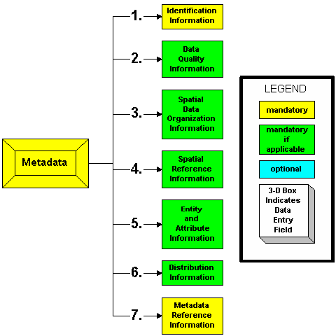

> You can have data without information, but you cannot have information without data.&#8221;
>
> --- Daniel Keys Moran, author and computer programmer

## Spatial Data

### What's so special about spatial?

> GIS is like the machinery that transforms data into the commodity--information--that is needed to solve problems or create opportunities.&#8221;
>
> --- @dibiase18

GIS data files are complicated.
One GIS dataset often consists of multiple linked files that contain different bits of information.
It is common for a particular GIS dataset to have a data file and then separate files used to describe the spatial parts of the data.

Spatial data is traditionally found in one of two formats: **vector** or **raster**.

------------------------------------------------------
Vector                      Raster
--------------------------  --------------------------
Mathematical equations      Pixel based

Easily scaled without       Does not scale up very
losing quality              well; typically in a
                            prescribed resolution

Large dimensions maintain   Large dimensions have
small file size             large file sizes

Can be easily converted     Depending on complexity,
into raster format          conversion to vector can
                            be very time consuming

![Vector points][vpoint]    ![Raster points][rpoint]

![Vector lines][vline]      ![Raster lines][rline]

![Vector areas][varea]      ![Raster areas][rarea]

Example:                    Example:
[Vectors in Action][via]    [Raster drawing][rdw]
------------------------------------------------------

[rpoint]: images/raster_point.jpg "Raster Point" {height=150 width=auto}
[vpoint]: images/vector_point.jpg "Vector Point" {height=150 width=auto}
[rline]: images/raster_line.jpg "Raster Line" {height=150 width=auto}
[vline]: images/vector_line.jpg "Vector Line" {height=150 width=auto}
[rarea]: images/raster_area.jpg "Raster Area" {height=150 width=auto}
[varea]: images/vector_area.jpg "Vector Area" {height=150 width=auto}
[via]: https://www.intmath.com/vectors/math-vector-art.php#intbezcurves
[rdw]: http://makepixelart.com/free

## Vector Data

Vector Data
:   a classification of spatially referenced data, which includes *points*, *lines* (polylines) and *areas* (polygons)

Points
:   objects represented by a single pair of locational coordinates (for example, *x* and *y* or *latitude* and *longitude*); dimension = 0

Lines
:   sets of ordered and connected points that may describe linear features (for example, boundaries, roads, or rivers); dimension = 1

Areas
:   collections of line segments that close to form discrete units; dimension = 2

Main Concepts:
:   - Attributes
    - Feature Class
    - Shapefile

Vector data is the generic term for GIS data built up from defined points in space.
These can simply be points or can be linked into lines and polygons.
These features may also include additional non-spatial information called attributes.
GIS store these attributes in a table, which is linked to the spatial data.

Vector data does not really have a resolution because each point identifies a unique point in space.
These points are recorded with a certain precision (e.g., GPS is often &pm;10 meters or so) but this precision may not be known.
Despite this, vector data can still be imprecise or inaccurate!

A common file format for storing vector data is the *shapefile*.
A shapefile is actually a collection of at least four files, all of which share the same name, but have different file extensions that relate to the following information.

- **.shp**---The coordinates of the GIS vector features. A shapefile will only contain one type of point, line or polygon data.
- **.shx**---The extent (or limits) of the coordinates. These are used so often, it is convenient to have them stored in a separate file.
- **.prj**---The projection system of the coordinates.
- **.dbf**---A database file containing the attributes of each geographic feature.

A collection of same-type features (point, line or polygon) is called a feature class.

The key point here is that you have to keep all of the different parts of shapefiles together for the data to work.

*Be careful when moving GIS files!*

## Raster Data

Raster data is the GIS term for gridded data: an equally spaced grid where each cell (or pixel) has one value (digital number or DN) that represents the dominant value of that cell.
These values can be continuous (e.g. elevation or temperature) or discrete (e.g. population densities or habitat categories).
Sometimes raster data may contain null or 'no data' cells.
Examples of raster data include aerial and satellite imagery.

Raster datasets come in three varieties [@dempsey12]:

- thematic (e.g., Digital Elevation Model)
- spectral (e.g., aerial or satellite imagery used to derive vegetation or geologic information based on spectral signatures)
- picture (e.g., photograph)

The main advantage of raster data is the ability to portray continuous data that cannot be well represented by points, lines or polygons.

The main disadvantage of raster data is its inaccuracy as compared to vector data.

Raster Data
:   a classification of spatially referenced data, which comprise of cell-based surfaces

Cell
:   a square or rectangular pixel in a raster dataset

Continuous data
:   data that do not have well-defined geographic boundaries and when mapped appear to have smooth transitions from one value to another (e.g., temperature, elevation)

Discrete data
:   data that have specific values in fixed locations (e.g., buildings, roads, land cover types)

DN
:   digital number; the value of a raster cell

Pixel
:   short for picture element; the smallest element of information in an image

### Georeferencing

A georeferenced raster dataset has several pieces of geographic information:

- the projection of the raster data
- the resolution of the cells (dimension of each cell in the units of the projection)
- a reference point with known coordinates (usually the top left corner of the grid)

Many raster datasets are already georeferenced.
In these cases, when the raster is added to a GIS map, the data will automatically appear in the correct place with reference to the projection.

In other cases, the raster data is not georeferenced---this is often the case with aerial photos, some satellite images or scans of paper maps.
In order to turn such data into a GIS dataset, the data need to be georeferenced.

In georeferencing, a set of ground control points (GCPs) are used to orient the image in space and then this oriented image is resampled into a new dataset with cell boundaries and cell size defined in the projection.

Georeferencing
:   to define something in physical space (e.g., location, coordinate reference system, map projection)

## Metadata

> The data about other data.&#8221;
>
> ---Meriam Webster

Evaluating the quality of data can be difficult, especially if it was created by someone else.
Therefore, there is an obligation to those who create data to include a report that summarizes the data quality (e.g., the spatial accuracy) in addition to information on other aspects of the data (e.g., the creation date or when it was last updated, the geographic area/extent, the coordinate system, explanations of attributes, copyright info and/or use restrictions), in such a way as to inform potential users of the data's limitations and uses such that they can determine whether is best suited for their purpose.
This collection of information about data is called **metadata**. [@price12]

Geographic metadata seeks to answer questions, such as:

* Who developed the data?
* When was the data collected?
* How were the data processed?
* How are the data attributes defined?
* In what formats are the data available?
* How does one obtain the data?

### Standards

The Federal Geographic Data Committee (FGDC) and the International Organization for Standardization (ISO) have worked together to develop metadata standards, including:

* Content Standard for Digital Geospatial Metadata (CSDGM)
* ISO 19115

Faced with several standards, preparing a complete set of metadata can be a daunting task; however, it most cases, some information is better than none.
Regardless of the standard, the core components of the metadata record should include (https://www.fgdc.gov/metadata):

Metadata Record Information
:    information about the metadata record including the language in which the record is written, a unique file identifier for the metadata record, the metadata standard used to organize the record, a point of contact for the metadata record, and the date that the metadata record written

Identification Information
:   citation-level information about the data including the title, abstract, purpose for creation, status, keywords (theme and place), and extent (temporal, vertical and horizontal)

Constraints Information
:   information about legal and security limitations to data access and use

Data Quality Information
:   information about the processes and sources used to develop the data and positional and/or accuracy assessments performed

Maintenance Information
:   information about the scope and frequency of data updates

Spatial Representation
:   information about the mechanism used to represent spatial data (grid, point, vector)

Reference System Information
:   information about the reference systems used to represent geographic position and time

Content Information
:   information about the data set entities and attributes

Symbology Information
:   information about the symbols used to represent spatial features

Distribution Information
:   information about the data distributors and methods for obtaining the data

Metadata Extension Information
:   information about custom, user-based, changes to the elements, domains or conditionality of the standard

Application Schema Information
:   information about the schema or data models used to structure the data

## Databases

Geographic data (e.g., vector, raster and table) may be collectively stored together in what is called a geodatabase---a versatile format convenient for data editing and management.

These are several types of geodatabases.
The one we are focused on in this class is the *File geodatabase*.

File Geodatabase
:   This database type is designed for individuals or small groups.
    The data set is stored as a separate file within a system folder and each file can be up to one terabyte in size.

    File geodatabases are best for cross-platform operations (i.e., accessible by multiple operating system architectures, such as Windows, Macintosh, and Linux). [@price12]

## Database design

Good databases do not happen by accident [@price12].
Geodatabases are created as empty shells.
These shells have a defined organizational structure (this data model is called a *schema*) into which feature classes and other objects can be added.

One organizational method is to create *feature datasets*.
A feature dataset is a collection of feature classes that are related to one another (e.g., they are categorically similar) and share the same spatial reference.

One advantage of geodatabases is the ability to define a set of rules for data attributes.
This is accomplished through the use of an attribute *domain*---pre-defined attribute value constraints.

There are two types of domains: *range domains* and *coded domains*.

Range domains
:   A specification of the lowest and highest acceptable values.

Coded domains
:   A specification list of acceptable values.
    These values are made of code and textual description pairs.

## References
