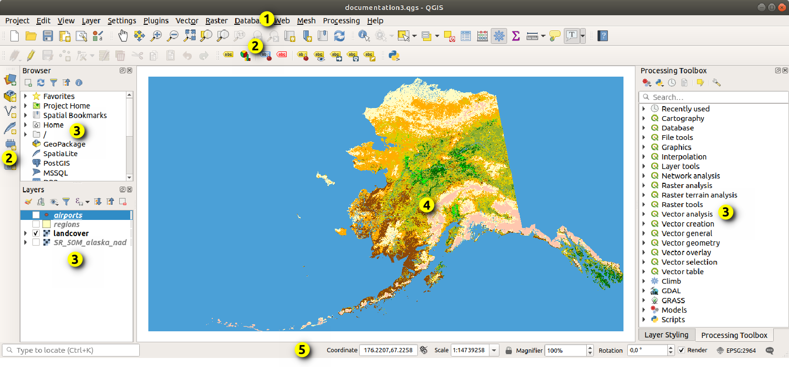
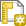

The goal of this lesson is to introduce you to the field of Remote Sensing and the geographic information software, [QGIS](http://www.qgis.org), the leading open-source desktop GIS software.

<div class="info">
Before you begin, please read the [chapter on remote sensing](chapter-7-remote-sensing.html).
</div>

We will investigate Earth observations in three spectral bands (visible to near-infrared) from the [Advanced Spaceborne Thermal Emission and Reflection Radiometer (ASTER)](https://asterweb.jpl.nasa.gov/instrument.asp), a high-resolution sensor onboard NASA's [Terra](https://terra.nasa.gov/about) satellite.


## Setup

### Get QGIS
The 2019-2020 LTR (long-term service release) of QGIS is version 3.10 'A Coru&ntilde;a'.
If you want to install QGIS on your own computer, simply go to the QGIS website:

- http://www.qgis.org/en/site/forusers/download.html

and download the installer for your operating system (it is available for all major OS's including Windows[^1], Mac[^2] and Linux[^3]).

[^1]: Windows is a registered trademark of Microsoft Corporation in the United States and/or other countries.
[^2]: Mac is a trademark of Apple Inc., registered in the United States and other countries.
[^3]: Linux&reg; is the registered trademark of Linus Torvalds in the United States and other countries.

For help using QGIS, you may wish to consult the [QGIS Documentation](https://www.qgis.org/en/docs/index.html), which includes a user guide and training modules.

### Get data
There are three raster images you need to download.
They are available in a single zip file.
Download `bands123` [(.zip)](https://drive.google.com/file/d/15ZvjdVAyvQgPiccmGqnbHXgDEUdh_UD0/view?usp=sharing) and extract the compressed zip file to your computer.

The zip file should contain the following six files:

:   The six files located in the unzipped RS_bands123 folder.

+---------------------+----------------------+
| - band1.tif         | - band1.tif.aux.xml  |
| - band2.tif         | - band2.tif.aux.xml  |
| - band3.tif         | - band3.tif.aux.xml  |
+---------------------+----------------------+

Copy these six files to your workspace folder (e.g., `C:\Workspace\rs`).

## QGIS
Launch the QGIS Desktop app.

Once the software has loaded, you may be greeted with a Tips! popup, which you can dismiss.

*Note: some icons may look different, depending on the version of QGIS.*

Click on the New Project button, {height=20 width=20}, in the toolbar to open a new blank project.

Click the Save Project button, {height=20 width=20}, in the toolbar and save your project to your workspace folder.

__Note that the .qgs project file is similar to the .mxd ArcMap map document and the .aprx ArcGIS Pro project file.__

Take a look at the software's graphical user interface (GUI)---an example is shown in **Figure 2** below---and notice some of the similarities and differences.

- A menu bar and two toolbars replace the ArcGIS Pro ribbon
- Panels replace panes
- A similar map view and status bar below the map



## Image Exploration
In the Toolbar, click the button for the Data Source Manager, , to open the Data Source Manager window and click the icon to Add Raster Layer, {height=20 width=20}.

Next to the Source input box, click the ellipses, navigate to your workspace folder and add `band1.tif`.

_Note: when you click "Add," you may receive a pop-up window about selecting a transformation for band1; you may click "OK" to select the first recommended option._

Click "Close" to exit the Data Source Manager.

The layer `band1` is added to the Layers Panel.

Double-click the layer name to open the Layer Properties window.

Under "Information," find the layer's coordinate reference system (CRS).

<div class="question">
Q1. What is the layer's coordinate system?

<span style="color:#efefef;">EPSG:26711 - North American Datum 1927, UTM Zone 11N</span>
</div>

In the information from provider section, investigate the properties (you may have to scroll down to find Properties).

<div class="question">
Q2. What is the **pixel size**? What is the **unit** for the pixel size?

<span style="color:#efefef;">15 meters x 15 meters</span>

Q3. What is the **data type**?

<span style="color:#efefef;">Byte - eight bit unsigned integer<span>

Q4. In what wavelength of the electromagnetic (EM) spectrum is this image taken? What does this wavelength represent? *Hint: refer to the chapter on remote sensing for information on wavelengths.*

<span style="color:#efefef;">0.556 microns - visible green</span>
</div>

Back in your workspace folder, open the `band1.tif.aux.xml` file (e.g., WordPad in Windows).

<div class="question">
Q5. How many lines and samples are in the image? Based on the number of lines and samples (i.e., columns and rows) and the data type (from Q3), what is the file size that you would expect band1.tif to have?

<span style="color:#efefef;">lines: 1700; samples: 1700;
    (1700) x (1700) x (1 byte) = 2.89 MB</span>

Q6. Based on the number of samples (i.e., number of pixels across the image) and the pixel size (from Q2), what is the swath size (in kilometers)?

<span style="color:#efefef;">(1700 pixels) x (15 m/px) = 25.5 km</span>
</div>

You can close `band1.tif.aux.xml` and return to your QGIS project.

## Grayscale Image Analysis
Use the Pan Map and Zoom In/Out tools to investigate the grayscale band1 image.

<div class="question">
Q7. Can you find the location of one of the golf courses?<br />
(Hint: what would you expect the DN value of this feature to be in this wavelength?)
</div>

To investigate a pixel's DN value, use the Identify Features button ({#id .class height=20 width=20}) and click on a pixel to open the Identify Results panel.

Click around to investigate the DN values found within the dark area in the right part of the image.

<div class="question">
Q8. What do you think is making the large dark area in the right part of the image?

<span style="color:#efefef;">Lake Mead</span>
</div>

Let's take a deeper look.

Open the layer properties again.

Under "Histogram," click the Compute Histogram button, then click the "Save plot" button (little blue diskette) and save a copy of the histogram (e.g., `hist1.png`) to your workspace folder.
Investigate the histogram.

<div class="question">
Q9. What feature is likely causing the spike in the histogram at lower DN values?

<span style="color:#efefef;">Notice that the DN values match that large dark area; so that's Lake Mead again.</span>
</div>

Let's take an even deeper look.

Open the layer properties again.
Under "Symbology," you will see in the Band rendering section that the render type is "Singleband gray" and that the color gradient is currently set to "Black to white" with a contrast enhancement set to stretch to min/max values.

Based on the histogram and your investigation of the DN values, see if you can find any patterns within the dark region by applying different max/min values.

<div class="question">
Q10. What DN range did you choose? What patterns did this range reveal in the lake? What are the patterns, their general direction and what might their cause be?

<span style="color:#efefef;">Min/max values of 50 and 75 reveal cloud-like features in the water.</span>
</div>

Load back the image's original min and max values.

_You can do this by clicking to expand the Min / Max Value Settings, selecting the Min / max radio button, setting the accuracy to Actual (slower), and clicking "Apply."_

Okay, now that we know we are looking at a lake, see if you can find the southern-most boat marina.

<div class="question">
Q11. What could that bright group of pixels be?

<span style="color:#efefef;">Likely something metal; a boat or roof of a shed</span>
</div>

That's it for single-band grayscale analysis.
Now, let's take a look at some color images.

## Color Image Analysis
Use the Data Source Manager to add raster layers `band2.tif` and `band3.tif`.

Take a moment to investigate these two bands and how they compare to band 1.

_You can change each layer's visibility by ticking the checkbox next to their name in the Layers panel. Also, check out their layer properties and/or their `.aux.xml` files._

In the Menu Bar, click on "Raster" and under Miscellaneous and click on "Merge."

- Click the "..." button next to "Input layers"
    - select all ("band1," "band2," and "band3")
- Check the box next to "Place each input file into a separate band"
- Change the output data type to "Byte"
- Click on "..." button next to where it says "[Save to temporary file]" and select "Save to file"
    - in your workspace folder, save the output as "band321.tif"
- Click OK to run the tool

Uncheck band1, band2 and band3 in the Layers panel, keeping band321 visible.

Open the layer properties of band321.

Under "Style" set the following:

- Band rendering
    - Red band: band2
    - Green band: band3
    - Blue band: band1
    - Contrast enhancement: "Stretch to MinMax"
- Load the min/max value settings
    - select Min/max
    - select Actual (slower) accuracy

Examine the false color image.

*A false-color image is an image that depicts an object in colors that differ from those a photograph would show.*

<div class=question>
Q12. What does the green color signify in this image?

<span style="color:#efefef;">
green: band3 (nir), which should be highlighting vegetation
</span>

Q13. Are the golf courses easier to see in this image? Why or why not?

<span style="color:#efefef;">Yes, they show up green.</span>

Q14. Can you find the cloud in this image? Where is it approximately located?

<span style="color:#efefef;">it's near (691087,4007653); not the black spot above it</span>
</div>

Use the Identify Features tool to find the DN values of the cloud.

<div class="question">
Q15. What are the average DN values of each band for the cloud?

<span style="color:#efefef;">they should be near 255 in the visible spectrum</span>

Q16. What is the dark object directly to the upper left of the cloud?

<span style="color:#efefef;">that's the cloud's shadow on the ground</span>
</div>

Open the output folder and check the file size of `band321.tif`.

<div class="question">
Q17. Does the file size match what you expect based on the number of samples, lines and bands?

<span style="color:#efefef;">
(1700) x (1700) x (3 bands) x (1 byte) = 8.67 MB
</span>
</div>

## Spatial Filters

### High-pass filter
The first image-processing filter we will test is the high-pass filter.

Uncheck all layers except for band1.

Create a new Text Document in your workspace folder.
Call the file "filter.txt" (*double check to make certain your file is not named `filter.txt.txt`, as QGIS will complain about this*) and copy-and-paste the following into the text file, save, and close the file.

```
TITLE     3x3 high-pass filter
MATRIX    3
-1 -1 -1
-1 8 -1
-1 -1 -1
DIVISOR   9
TYPE      P

```

Click on Processing in the Menu Bar and select Toolbox to open the Processing Toolbox panel.

In the search bar, type "mfilter" and select `r.mfilter` or navigate to:

- GRASS GIS 7 commands
    - Raster (r.\*)
        - r.mfilter - Performs raster map matrix filter

<div class="error">
If you receive an error message that GRASS is not properly configured, save and close QGIS, open the QGIS Desktop with GRASS app, and reopen your project file.
</div>

In the r.mfilter tool window input/select the following:

- Input layer: band1
- Filter file: filter.txt (click the ... button and find the `filter.txt` file you created)
- Number of times to repeat the filter: 1
- Filtered: hp_filter.tif (click the ... button, click "Save to file," and save the output to your folder)
- Click Run

In the Symbology of the layer properties:

- under Band rendering, update the max/min values (use actual values)
- under Color rendering, change the blending mode from "Normal" to "Overlay"

<div class="question">
Q18. What improvements are the result of the high-pass filter?
</div>

### Directional filter
To highlight the patterns in the lake, we can run a directional filter over band1 that emphasizes the variations of interest.

Uncheck the high pass filter layer.

Create a second new Text Document called `vfilter.txt` and copy-and-paste the following, save and close the file.

```
TITLE     3x3 directional (valley) filter
MATRIX    3
0  1  1
-1  0  1
-1  -1  0
DIVISOR   1
TYPE      P

```

Run the `r.mfilter` tool again only using the vfilter.txt this time.
Save the output as `dfilter1.tif` and include this image in your lab report.

Name the layer "Valleys" in the General of the layer properties.

In the Symbology of the layer properties:

- under Band rendering, update the max/min values (use actual values)
    - set the max value equal to zero (0) to emphasize only the negative values
- under Color rendering, change the blending mode from "Normal" to "Soft light"

Take a moment to compare and contrast the different features that the two filters highlight (high-pass versus directional) over landscapes and urban areas.

CHALLENGE

:   - Create a third filter text file (`pfilter.txt`)
    - Swap the negative an positive values to emphasize peaks instead of valleys
    - Save the filter as `dfilter2.tif`
    - Name the new layer "Peaks"
    - Update the actual max/min values
    - Set the maximum value to zero (0)
    - Change the blending mode to "Soft light"
    - Apply both the peaks and valleys filters over band 1
    - How does the image look now?

<div class="question">
Q19. What is the benefit of the directional filter for showing patterns in the lake over changing the linear stretch of DN values as was done in the grayscale analysis?
</div>

## Image Layout and Export
Use the New Print Layout button, {height=20 width=20}, to create output figures (also available through the Project menu in the menu bar).

You may give your new Print Composer a name (optional) and click OK.

The print composer window looks similar to the QGIS GUI, where there is a menu bar, toolbars, and a composer viewer, which shows you what your figure will look like (similar to the layouts in ArcGIS).

In the toolbar on the left, click Add New Map, {height=20 width=20}, then click and drag a square over your blank page.

Use the tools in the toolbar on the left to add other items to your figure, such as text (Add new label, {height=20 width=20}), legend (Add new legend, {height=20 width=20}), scale (Add new scalebar, {height=20 width=20}).

For each item, when they are selected (using the Select/Move item tool, {height=20 width=20}, in the toolbar on the left), their properties will appear in the panel on the right.
You can edit item properties in the Item properties tab (e.g., text and font styles for labels).

When the figure looks as you want it, click on either the Export as image ({height=20 width=20}) or Export as PDF ({height=20 width=20}) button in the toolbar at the top (also found in the Composer menu in the menu bar).

## Deliverables
Please write a summary of your work for this activity.

You may work together in groups.
Please turn in one report per group (make certain everyone's names are listed in the report).

Your report should include a brief introduction (e.g., where the data came from and what the data represents), the methods you implemented, the results you found.
Include the following figures:

- histogram of band1
- the linear stretch
- a false color image
- filtered images

Use the questions posed throughout the activity as a guide.

In your report include a short review of your experience using QGIS.
Feel free to compared QGIS to the other GIS software tools you have used.
