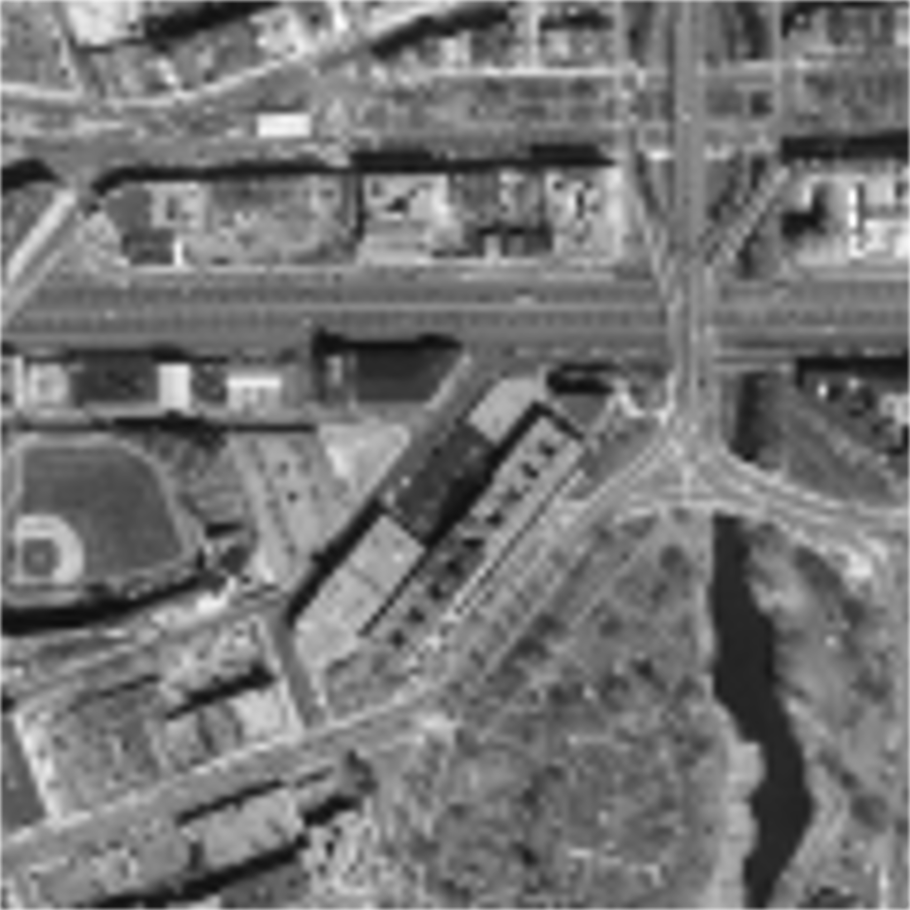
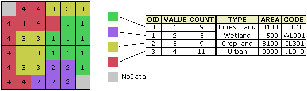

<section data-background-image="images/title.png" data-background-size="contain">
</section>

# Raster Analysis

* Raster data
* Raster algebra and statistics
* Conditional and reclassifications
* Exercise A
* Applications in Remote Sensing
* Exercise B

<small> This presentation is written in [reveal.js](https://revealjs.com). Click the link to learn more about how to navigate reveal.js presentations.</small>

# Raster Data

<section data-background-image="images/rdat.png" data-background-size="contain">
A spatial data model that represents the world as a regular grid of cells (sometimes called a raster image) where each cell is assigned a numeric value.
</section>

***

Recall:

Cells (or pixels) have dimension (height and width), which corresponds to the area on the ground that each cell covers.
This is referred to as the raster's **resolution**.

Smaller cell size = higher resolution = greater detail

<small>(note: high resolution can lead to long process time because there are a lot of pixels to process)</small>

***

{height="500" width="500"}

***

{height="500" width="500"}

***

{height="500" width="500"}

***

{height="500" width="500"}

***

So, we see generalization of features and loss of detail as the pixel size increases.

<small>That's because you can only fit one value per pixel.</small>

Recall what you learned about data scale and map scale (same idea).

***

Rasters are grids of numbers

and we can add, subtract, multiply, and divide numbers.

# Raster Analysis

Calculations of cell values from one or more raster layers

***

Let's start with a simple raster with three rows and three columns, given by the following:

 

$$
\begin{array}{|c|c|c|}
\hline
1 & 2 & 5 \\
\hline
6 & 3 & 9 \\
\hline
4 & 6 & 2 \\
\hline
\end{array}
$$

***

Basic scalar multiplication

 

$$
2 \times
\begin{array}{|c|c|c|}
\hline
1 & 2 & 5 \\
\hline
6 & 3 & 9 \\
\hline
4 & 6 & 2 \\
\hline
\end{array} =
\begin{array}{|c|c|c|}
\hline
2 & 4 & 10 \\
\hline
12 & 6 & 18 \\
\hline
8 & 12 & 4 \\
\hline
\end{array}
$$

<small>Each pixel multiplied by one number.</small>

***

Calculations from two or more raster layers are performed *pixel by pixel*

 

$$
\begin{array}{|c|c|c|}
\hline
1 & 2 & 5 \\
\hline
6 & 3 & 9 \\
\hline
4 & 6 & 2 \\
\hline
\end{array} +
\begin{array}{|c|c|c|}
\hline
3 & 5 & 14 \\
\hline
8 & 6 & 5 \\
\hline
9 & 0 & 2 \\
\hline
\end{array} =
\begin{array}{|c|c|c|}
\hline
4 & 7 & 19 \\
\hline
14 & 9 & 14 \\
\hline
13 & 6 & 4 \\
\hline
\end{array}
$$

<small>Notice that pixel location is important, especially if the raster layers represent the same area.</small>

***

These operations can be combined into algorithms (i.e., **raster algebra**)

 

$$
5 \times
\begin{array}{|c|c|c|}
\hline
1 & 2 & 5 \\
\hline
6 & 3 & 9 \\
\hline
4 & 6 & 2 \\
\hline
\end{array} -
\begin{array}{|c|c|c|}
\hline
3 & 5 & 14 \\
\hline
8 & 6 & 5 \\
\hline
9 & 0 & 2 \\
\hline
\end{array} =
\begin{array}{|c|c|c|}
\hline
2 & 5 & 11 \\
\hline
22 & 9 & 40 \\
\hline
11 & 30 & 8 \\
\hline
\end{array}
$$

<small>Remember your order of operations from algebra class!</small>

***

We can even perform statistics!

 

$$
\begin{array}{|c|c|c|}
\hline
3 & 5 & 14 \\
\hline
8 & 6 & 5 \\
\hline
9 & 0 & 2 \\
\hline
\end{array}
$$

* Maximum: 14
* Minimum: 0
* Average: (3+5+14+8+6+5+9+0+2)/9 = 5.78

***

We don't always have to perform analysis over an entire raster layer.

***

Instead, we can perform focal analyses (sometimes called kernel or neighborhood statistics).

***

$$
\begin{array}{|c|c|c|c|c|c|}
\hline
4 & 9 & 13 & 6 & 11 & 7 \\
\hline
7 & 2 & 1 & 2 & 8 & 8 \\
\hline
9 & 12 & 6 & 6 & 3 & 9 \\
\hline
2 & 3 & 1 & 7 & 1 & 10 \\
\hline
15 & 13 & 6 & 14 & 9 & 10 \\
\hline
9 & 7 & 20 & 15 & 17 & 9 \\
\hline
\end{array}
$$

Let's say we have a raster with six rows and six columns.

***

Let's see if we can find focal minimum values 
in a $3 \times 3$ moving window.

$$
\begin{array}{|c|c|c|c|c|c|}
\hline
4 & 9 & 13 & 6 & 11 & 7 \\
\hline
7 & 2 & 1 & 2 & 8 & 8 \\
\hline
9 & 12 & 6 & 6 & 3 & 9 \\
\hline
2 & 3 & 1 & 7 & 1 & 10 \\
\hline
15 & 13 & 6 & 14 & 9 & 10 \\
\hline
9 & 7 & 20 & 15 & 17 & 9 \\
\hline
\end{array}
$$

***

$$
\begin{array}{|c|c|c|c|c|c|}
\hline
{\color{blue}4} & 9 & 13 & 6 & 11 & 7 \\
\hline
7 & 2 & 1 & 2 & 8 & 8 \\
\hline
9 & 12 & 6 & 6 & 3 & 9 \\
\hline
2 & 3 & 1 & 7 & 1 & 10 \\
\hline
15 & 13 & 6 & 14 & 9 & 10 \\
\hline
9 & 7 & 20 & 15 & 17 & 9 \\
\hline
\end{array}
$$

To begin, we look at the first (top-left) value, which is 4.

***

Then we look at the eight values that surround it. <small>note that along the top and left edges there are no values, so we just ignore them</small>

$$
\begin{array}{|c|c|c|c|c|c|}
\hline
{\color{blue}4} & {\color{red}9} & 13 & 6 & 11 & 7 \\
\hline
{\color{red}7} & {\color{red}2} & 1 & 2 & 8 & 8 \\
\hline
9 & 12 & 6 & 6 & 3 & 9 \\
\hline
2 & 3 & 1 & 7 & 1 & 10 \\
\hline
15 & 13 & 6 & 14 & 9 & 10 \\
\hline
9 & 7 & 20 & 15 & 17 & 9 \\
\hline
\end{array}
$$

***

$$
\begin{array}{|c|c|c|c|c|c|}
\hline
{\color{blue}4} & {\color{red}9} & 13 & 6 & 11 & 7 \\
\hline
{\color{red}7} & {\color{red}2} & 1 & 2 & 8 & 8 \\
\hline
9 & 12 & 6 & 6 & 3 & 9 \\
\hline
2 & 3 & 1 & 7 & 1 & 10 \\
\hline
15 & 13 & 6 & 14 & 9 & 10 \\
\hline
9 & 7 & 20 & 15 & 17 & 9 \\
\hline
\end{array}
$$

Then we check these nine values (four in this edge case) and calculate their minimum (it's 2), which will replace the 4 in our output.

***

Let's skip down to the 2

$$
\begin{array}{|c|c|c|c|c|c|}
\hline
4 & 9 & 13 & 6 & 11 & 7 \\
\hline
7 & {\color{blue}2} & 1 & 2 & 8 & 8 \\
\hline
9 & 12 & 6 & 6 & 3 & 9 \\
\hline
2 & 3 & 1 & 7 & 1 & 10 \\
\hline
15 & 13 & 6 & 14 & 9 & 10 \\
\hline
9 & 7 & 20 & 15 & 17 & 9 \\
\hline
\end{array}
$$

***

$$
\begin{array}{|c|c|c|c|c|c|}
\hline
{\color{red}4} & {\color{red}9} & {\color{red}{13}} & 6 & 11 & 7 \\
\hline
{\color{red}7} & {\color{blue}2} & {\color{red}1} & 2 & 8 & 8 \\
\hline
{\color{red}9} & {\color{red}{12}} & {\color{red}6} & 6 & 3 & 9 \\
\hline
2 & 3 & 1 & 7 & 1 & 10 \\
\hline
15 & 13 & 6 & 14 & 9 & 10 \\
\hline
9 & 7 & 20 & 15 & 17 & 9 \\
\hline
\end{array}
$$

and look at the eight surrounding values

***

and we see the minimum of these 9 values is 1 
<small>1 will replace the 2 in our output</small>

$$
\begin{array}{|c|c|c|c|c|c|}
\hline
{\color{red}4} & {\color{red}9} & {\color{red}{13}} & 6 & 11 & 7 \\
\hline
{\color{red}7} & {\color{blue}2} & {\color{red}1} & 2 & 8 & 8 \\
\hline
{\color{red}9} & {\color{red}{12}} & {\color{red}6} & 6 & 3 & 9 \\
\hline
2 & 3 & 1 & 7 & 1 & 10 \\
\hline
15 & 13 & 6 & 14 & 9 & 10 \\
\hline
9 & 7 & 20 & 15 & 17 & 9 \\
\hline
\end{array}
$$

***

Repeat this process for each cell.

***

The minimum around 1 is 1.

$$
\begin{array}{|c|c|c|c|c|c|}
\hline
4 & {\color{red}9} & {\color{red}{13}} & {\color{red}6} & 11 & 7 \\
\hline
7 & {\color{red}2} & {\color{blue}1} & {\color{red}2} & 8 & 8 \\
\hline
9 & {\color{red}{12}} & {\color{red}6} & {\color{red}6} & 3 & 9 \\
\hline
2 & 3 & 1 & 7 & 1 & 10 \\
\hline
15 & 13 & 6 & 14 & 9 & 10 \\
\hline
9 & 7 & 20 & 15 & 17 & 9 \\
\hline
\end{array}
$$

***

The minimum around 2 is 1.

$$
\begin{array}{|c|c|c|c|c|c|}
\hline
4 & 9 & {\color{red}{13}} & {\color{red}6} & {\color{red}{11}} & 7 \\
\hline
7 & 2 & {\color{red}1} & {\color{blue}2} & {\color{red}8} & 8 \\
\hline
9 & 12 & {\color{red}6} & {\color{red}6} & {\color{red}3} & 9 \\
\hline
2 & 3 & 1 & 7 & 1 & 10 \\
\hline
15 & 13 & 6 & 14 & 9 & 10 \\
\hline
9 & 7 & 20 & 15 & 17 & 9 \\
\hline
\end{array}
$$

***

The minimum around 8 is 2.

$$
\begin{array}{|c|c|c|c|c|c|}
\hline
4 & 9 & 13 & {\color{red}6} & {\color{red}{11}} & {\color{red}7} \\
\hline
7 & 2 & 1 & {\color{red}2} & {\color{blue}8} & {\color{red}8} \\
\hline
9 & 12 & 6 & {\color{red}6} & {\color{red}3} & {\color{red}9} \\
\hline
2 & 3 & 1 & 7 & 1 & 10 \\
\hline
15 & 13 & 6 & 14 & 9 & 10 \\
\hline
9 & 7 & 20 & 15 & 17 & 9 \\
\hline
\end{array}
$$

***

and so we go until we find the focal minimum for each pixel

***

writing down the new values as we go

***

until we've searched the $3 \times 3$ windows around all our original values

***

and get a result like this

$$
\begin{array}{|c|c|c|c|c|c|}
\hline
2 & 1 & 1 & 1 & 2 & 7 \\
\hline
2 & 1 & 1 & 1 & 2 & 3 \\
\hline
2 & 1 & 1 & 1 & 1 & 1 \\
\hline
2 & 1 & 1 & 1 & 1 & 1 \\
\hline
2 & 1 & 1 & 1 & 1 & 1 \\
\hline
7 & 6 & 6 & 6 & 9 & 9 \\
\hline
\end{array}
$$

***

The neighborhood analysis is important for understanding local influences 
<small>(e.g., crime statistics or pollution levels)</small>

***

The window size and shape may be adjusted as well as the statistics type (e.g., average, maximum, sum) to accommodate a wide variety of analyses.

<small>For more on focal statistics, see [here](https://pro.arcgis.com/en/pro-app/tool-reference/image-analyst/how-focal-statistics-works.htm)</small>

***

Another important analysis that we can perform is the conditional (i.e., testing whether our pixel values meet certain conditions).

***

The output of conditional analysis are **boolean** rasters (i.e, a raster with pixel values that are either true or false or, because it has to be numeric, 1 or 0, respectively).

***

Example conditional statement: *"Where pixel value is greater than 5"*

 

$$
\mathrm{Input} =
\begin{array}{|c|c|c|}
\hline
3 & 5 & 14 \\
\hline
8 & 6 & 5 \\
\hline
9 & 0 & 2 \\
\hline
\end{array}
$$

 

$$
\mathrm{Output} =
\begin{array}{|c|c|c|}
\hline
0 & 0 & 1 \\
\hline
1 & 1 & 0 \\
\hline
1 & 0 & 0 \\
\hline
\end{array}
$$

***

Notice that false is equal to zero and true is equal to one.

***

This makes it easy to mix conditionals with raster algebra because multiplying by zero always returns zero and multiplying by one always returns the same value.

|   |   |
|:--|:--|
| 0 | False |
| 1 | True |

<small>note that, depending on your GIS, true and false values may be assigned any value of your choice</small>

***

This can be represented in a VAT (value attribute table) 
<small>an attribute table that associates raster values to a class, group, category, or membership</small>

<!--
IMAGE REFERENCE:
https://desktop.arcgis.com/en/arcmap/10.3/manage-data/raster-and-images/raster-dataset-attribute-tables.htm
-->

***

Example conditional used with raster algebra.

$$
A =
\begin{array}{|c|c|c|}
\hline
12 & 5 & 14 \\
\hline
8 & 16 & 5 \\
\hline
9 & 10 & 3 \\
\hline
\end{array}, B =
\begin{array}{|c|c|c|}
\hline
1 & 2 & 5 \\
\hline
6 & 3 & 9 \\
\hline
4 & 6 & 2 \\
\hline
\end{array}
$$

 

*Raster $B$ where raster $A$ is less than 10.*

$$
\mathrm{Output} =
\begin{array}{|c|c|c|}
\hline
0 & 2 & 0 \\
\hline
6 & 0 & 9 \\
\hline
4 & 0 & 2 \\
\hline
\end{array}
$$

 
<small>(note: this example assumes 0 represents no data)</small>

***

You can also change pixel values based on conditional statements in what is called **reclassification**.

***

Reclassifications typically have an input raster and a reclassification table that describes conditional statements along with their associated new pixel values.

***

:   Reclassification Table.

| Condition\* | New Value |
| :-------- | :-------: |
| $p < 5$ | 1 |
| $5 \le p < 10$ | 2 |
| $p \ge 10$ | 3 |

<small>\*where $p$ is pixel value</small>

 

$$
\mathrm{Input} =
\begin{array}{|c|c|c|}
\hline
12 & 5 & 14 \\
\hline
8 & 16 & 5 \\
\hline
9 & 10 & 3 \\
\hline
\end{array},
\mathrm{Output} =
\begin{array}{|c|c|c|}
\hline
3 & 2 & 3 \\
\hline
2 & 3 & 2 \\
\hline
2 & 3 & 1 \\
\hline
\end{array}
$$

***

<iframe width="560" height="315" src="https://www.youtube.com/embed/nQ6nzC4kQYk" frameborder="0" allow="accelerometer; autoplay; encrypted-media; gyroscope; picture-in-picture" allowfullscreen></iframe>

<small>
  
Please follow along with the video demonstration. 
<i>Note the correction at 11:36 where the maximum should be 11.</i>
</small>

# Exercise A

For this assignment, you'll want to grab a pen and paper.

***

Here are your raster sets:

$$
A =
\begin{array}{|c|c|c|c|}
\hline
16&18&24&28\\
\hline
16&20&26&30\\
\hline
14&18&20&26\\
\hline
14&16&18&22\\
\hline
12&14&14&18\\
\hline
\end{array},\;B =
\begin{array}{|c|c|c|c|}
\hline
30&33&30&27\\
\hline
27&27&24&21\\
\hline
27&24&21&18\\
\hline
24&24&21&15\\
\hline
18&15&15&12\\
\hline
\end{array}
$$

***

Perform the following tasks in the given order:

1. Multiply *A* by one half (i.e., 1/2 $\times$ *A*)
1. Multiply *B* by one third (i.e., 1/3 $\times$ *B*)
1. Add the two results together (i.e., 1/2 $\times$ *A* + 1/3 $\times$ *B*)
1. Subtract the result from *B* (i.e., *B* - 1/2 $\times$ *A* - 1/3 $\times$ *B*)

***

5. Apply the following reclassification on the result

 

:   Reclassification Table.

| Condition\* | New Value |
| :-------- | :-------: |
| $p < 0$ | 4 |
| $0 \le p < 4$ | 3 |
| $4 \le p < 8$ | 2 |
| $8 \le p < 12$ | 1 |
| $p \ge 12$ | 0 |

<small>\*where $p$ is pixel value</small>

***

6. Apply the following conditional to the result, setting true values equal to 1 and false values equal to 0.

 
*"Where the result is less than 2."*

***

7. What is the sum of all the resulting pixel values?
<!-- ans. 8 -->

***

8. Perform a 3 by 3 focal minimum on *A*
9. Perform a 3 by 3 focal maximum on *B*
10. Subtract what you get in step (8) from what you got in step (9)
11. What is the average pixel value of the results you got from step (10)?
<!-- ans. 12.45 -->

# Applications
There are numerous applications where raster analysis, raster algebra, and neighborhood statistics are useful.
One such application is in the broad field of remote sensing, specializes in the analysis of raster images.

***

<iframe width="560" height="315" src="https://www.youtube.com/embed/sx3skSTI2Co" frameborder="0" allow="accelerometer; autoplay; encrypted-media; gyroscope; picture-in-picture" allowfullscreen></iframe>

<small>
  
Please watch this brief introduction to the field of remote sensing.
</small>

***

Please find the deliverables worksheet for Lab 9 Exercises A and B on Blackboard
