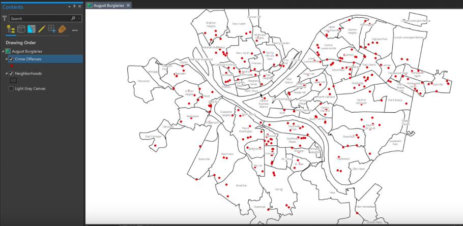
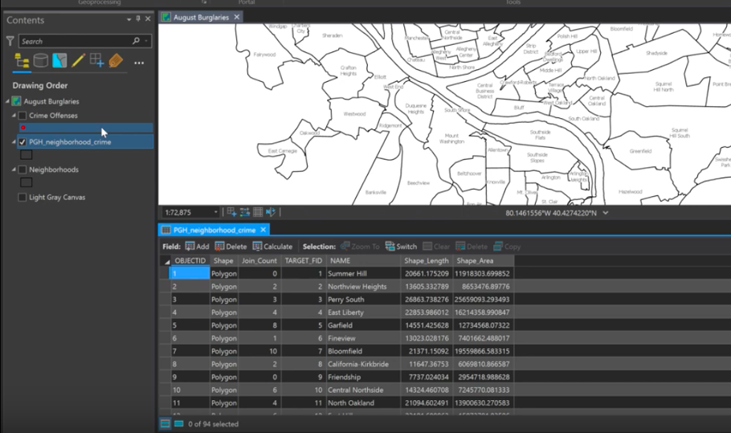
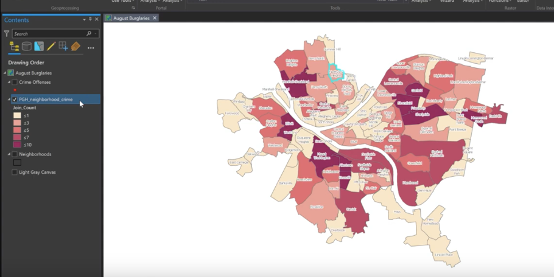

***

The Spatial Join tool is used commonly in geospatial analysis with ArcGIS.
A spatial join involves matching rows from the 'join layer' to the 'target layer' based on spatial relationships and writes to a new output feature class.

​For this tutorial, we will be considering crime offenses in different neighborhoods of Pittsburgh, and we will use a spatial join to create a new field that tells us the count of crime offenses falling within each neighborhood.
The tutorial will also detail how to symbolize the final feature class.

---

### Step 1: Visualize our Data

The 'Neighborhoods' feature class includes polygons of the neighborhoods of Pittsburgh, and 'Crime Offenses' includes point data of crimes that occurred within the month of August.

---

### Step 2: Create a Spatial Join

Open the  **Spatial Join Tool**  by right clicking on 'Neighborhood', hovering over 'Joins and Relates', then clicking on 'Spatial Join'.
We right click 'Neighborhood' because it is the target feature for this join.
In other words, it is the layer in which we will be trying to join data from another layer (Crime Offenses) into, to eventually create a third layer.

​'Neighborhoods' should auto fill as the Target Feature.
Select 'Crime Offenses' as the Join Feature.
Rename the Output Feature Class to something useful and descriptive.
Leave Join Operation as one to one, and leave the Keep All Target Features box checked.
​Remove all Output Fields you do not need in the final feature class by clicking the red X next to the various fields (optional).
In this case we are only retaining 'Name'.
This helps keep our new feature class as simple as possible.
Leave all the other options the same.
​
​​Click 'Run' at the bottom of the screen to execute the tool.

---

### Step 3: Examine the Attribute Table

When the process is complete, the new feature class will show up in the Table of Contents, shown above as 'PGH_neighborhood_crime'.
Open the Attribute Table by right clicking on the new feature layer and selecting 'Attribute Table'.
See that we have a new column 'Join_Count' that represents the number of crime offense points that fell within each neighborhood, and we retained the name of each neighborhood from the original target feature.

---

### Step 4: Change the Symbology

Open Symbology by right clicking on your new feature layer in the Table of Contents, and select 'Symbology'.
Under the drop down for 'Primary Symbology', select 'Graduated Colors', as shown in Figure 5.

'Field' should auto-select 'Join_Count' as the field to symbolize, which is correct, so next we pick a color scheme from the drop down menu as shown by Figure 6.
This will symbolize each neighborhood polygon by the count of crime offenses contained in each one.

---

### Step 5: View the Final Map

The neighborhoods of Pittsburgh are now colored based on the count of crime offenses, and each neighborhood is labeled.
The legend under 'Join_Count' in the Table of Contents shows the symbology of the new feature class created by the spatial join.
